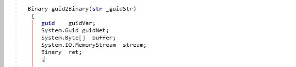

## AxBraceGuideLineExtension
It is the extension for Microsoft Dynamamics AX 2012 witch adding the ordinary feature for modern IDEs - showing guide lines for a code blocks.

By Microsoft's Dynamics AX 2012 development standards all a code indents should be multiple by 4 otherwise the check by Best Practices conformity will not be passed. 
Blocks violating this standard will be shown as a red line.

## Setup
Place the extension library into the Axapta's EditorComponents folder (.\Microsoft Dynamics AX\60\Client\Bin\EditorComponents\\).

## License
The AxBraceGuideLineExtension source code in this repo is available under the MIT license. See [License.txt](LICENSE.txt).
